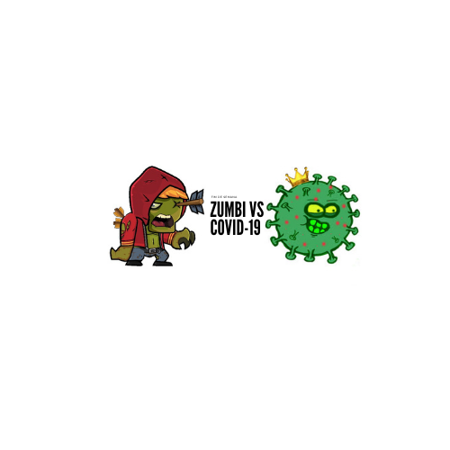

<h1 align="left">
  
</h1>

<h1 align="center">ZUMBI vs COVID-19</h1>

<p align="center">
  
  
  
  
  
</p>

> Status do Projeto: concluido :heavy_check_mark:

### Tópicos 

:small_blue_diamond: [Descrição do projeto](#descrição-do-projeto)

:small_blue_diamond: [Funcionalidades](#funcionalidades)

:small_blue_diamond: [Layout da Aplicação](#layout-da-aplicação-dash)

:small_blue_diamond: [Pré-requisitos](#pré-requisitos)

:small_blue_diamond: [Como rodar a aplicação](#como-rodar-a-aplicação-arrow_forward)


## Descrição do projeto 

<p align="justify">
  Nova versão do famoso jogo T-Rex Game (Dinosaur Game) proposto como "hands on" pelo Bootcamp DIO GFT START_UNI 2021 #1  
</p>

## Funcionalidades

:heavy_check_mark: Desenvolva suas habilidades em fugir do COVID-19  

## Layout da Aplicação :dash:

<h1 align="center">
  
</h1>

## Pré-requisitos

:warning: Não há pré-requisitos para jogar basta ter um navegador web como [Chrome](https://www.google.pt/intl/pt-PT/chrome/)

## Como rodar a aplicação :arrow_forward:

No terminal, clone o projeto: 

```
git clone https://github.com/calljef/Zumbi-Vs-COVID-19
```
- [x] Abra a pasta onde foi clonado o projeto
- [x] Abra o arquivo index.html com seu navegador
- [x] Inicie o jogo com a tecla space

## Linguagens, dependencias e libs utilizadas :books:

- [HTML5](https://www.w3schools.com/html/default.asp)
- [CSS3](https://www.w3schools.com/css/default.asp)
- [javaScript](https://www.w3schools.com/js/default.asp)

## Tarefas em aberto

:memo: Criar score 

:memo: Criar novos inimigos 

:memo: Refatorar JavaScript melhorando a jogabilidade 

## Desenvolvedores/Contribuintes :octocat:

<table>
  <tr>
    <td align="center"><a href="https://github.com/calljef">
      <br /><sub><b>Jeferson Nascimento</b></sub>
      </a><br /><a href="https://github.com/calljef/Zumbi-Vs-COVID-19" title="ZUMBI VS COVID-19">🌐🚀</a></td>
  </tr>
</table

## Licença 

The [MIT License]() (MIT)

Copyright :copyright: 2020 - Zumbi vs COVID-19
